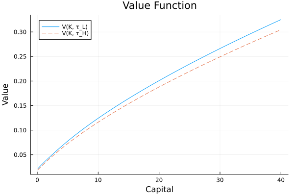
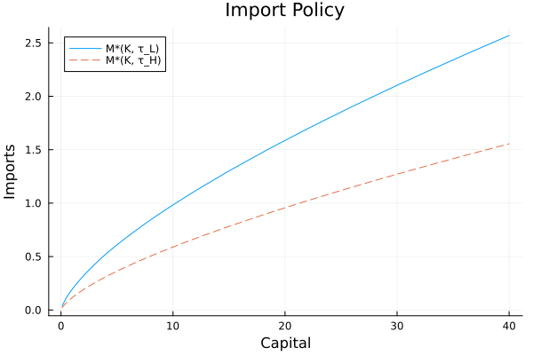
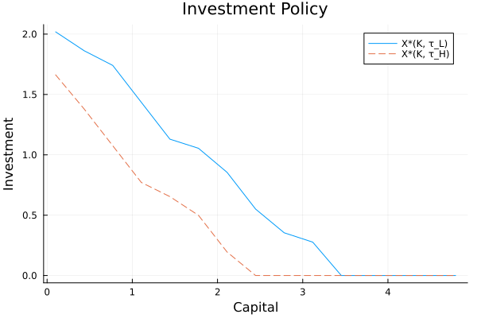
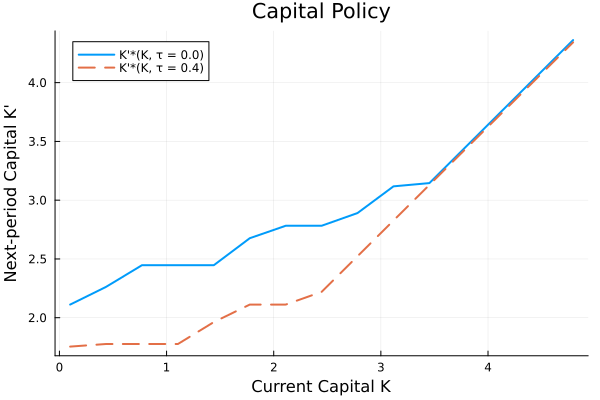
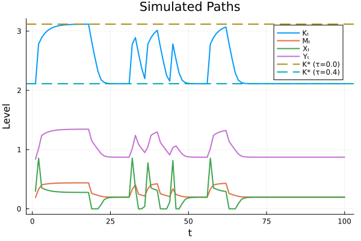
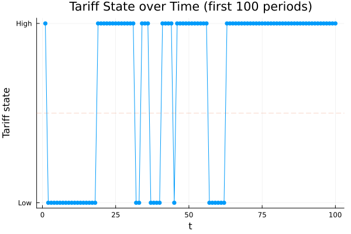

# Dynamic Firm Optimization with Learning-by-Importing Under Tariff Uncertainty

A dynamic computational model examining how tariff uncertainty affects a firm's optimal import, investment, and capital accumulation decisions over time. Developed for ECON 417: Computational Methods in Economics at Yale University.

## Overview

Tariffs raise the effective cost of imported inputs, disrupting firm-level production decisions, discouraging investment, and reducing productivity. This project builds a dynamic optimization model to study these effects intertemporally — capturing how firms respond not just to current tariff levels, but to the risk of future tariff changes.

The model features:
- **Cobb-Douglas production** using capital (*K*) and imported intermediate inputs (*M*)
- **Learning-by-importing**: a share of imports augments the firm's future capital stock
- **Stochastic tariff regime**: tariffs follow a two-state Markov process (low/high), creating persistent uncertainty
- **Bellman iteration** with nested Brent optimization to solve for optimal policy functions

## Key Results

| Tariff Rate | Steady-State Capital | Steady-State Imports | Steady-State Investment |
|---|---|---|---|
| Low (0%) | 3.12 | 0.44 | 0.28 |
| High (40%) | 2.11 | 0.20 | 0.20 |

- Lower tariffs lead to uniformly higher imports, investment, and capital accumulation
- The gap between low- and high-tariff optimal imports widens as capital increases
- Under tariff uncertainty, capital tracks shifts in the tariff regime, stabilizing at higher levels under low tariffs

### Value Function



### Optimal Policy Functions

| Import Policy | Investment Policy | Capital Policy |
|:---:|:---:|:---:|
|  |  |  |

### Simulated Paths Under Stochastic Tariffs

| Simulated Economic Dynamics | Tariff State Transitions |
|:---:|:---:|
|  |  |

The full analysis and discussion are in [`report/ox4_417finalreport.pdf`](report/ox4_417finalreport.pdf).

## Model

The firm maximizes discounted expected utility of profits:

```
V(K, τ) = max { U(Π(K, M, X; τ)) + β E[V(K', τ') | τ] }
```

subject to the capital law of motion:

```
K' = (1 - δ)K + X + ψM
```

where *Π* is per-period profit under a Cobb-Douglas production function, *τ* is the tariff rate, *X* is investment, and *ψ* captures the learning-by-importing channel.

## Repository Structure

```
├── firm_optimization.jl   # Main Julia script (value function iteration, simulation, plots)
├── report/
│   └── ox4_417finalreport.pdf  # Full project report
├── plots/                 # Generated figures
│   ├── value_function.png
│   ├── imports.png
│   ├── investment.png
│   ├── capital_policy.png
│   ├── converge_K_exact.png
│   ├── converge_M_exact.png
│   ├── converge_X_exact.png
│   ├── simulated_paths.png
│   └── state_transitions.png
└── LICENSE
```

## Running

Requires Julia with the following packages:

```julia
using Printf, LinearAlgebra, Random, NLsolve
using Interpolations, Statistics, Roots
using Optim
using Plots
```

Run the full model and generate all plots:

```bash
julia firm_optimization.jl
```

## License

MIT
